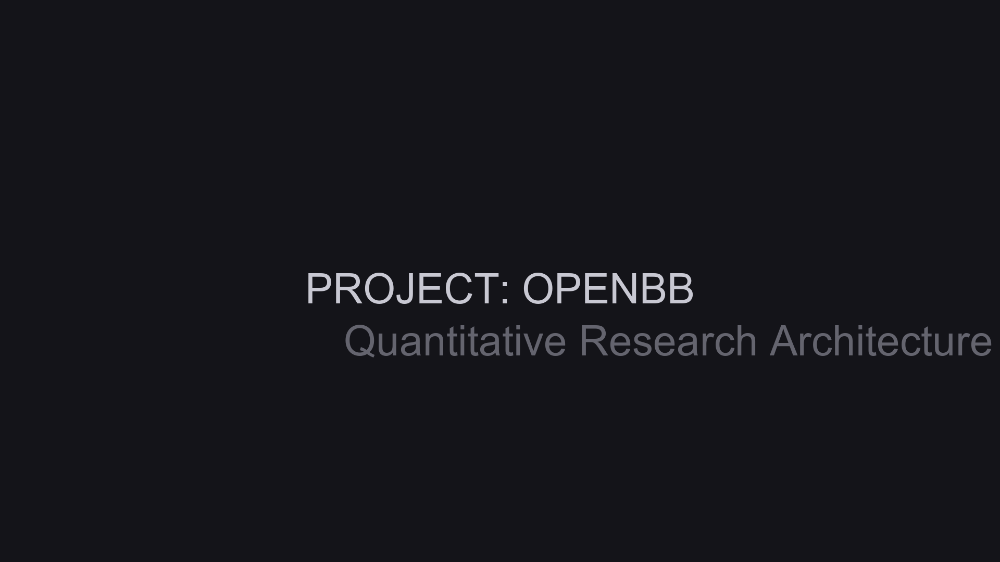

# Openbb
**Quantitative Research & Development Portfolio**

## 1. Project Overview
This repository contains the source code, data pipelines, and research findings for the `openbb` project, developed as part of a proprietary quantitative research environment.

**Category**: Dashboards And Apps

## 2. Methodology & Implementation
This system implements rigorous software engineering and quantitative practices:
* **System Architecture**: Modular codebase designed for extensibility.
* **Data Processing**: Robust data ingestion and transformation pipelines.
* **Validation**: Integrated statistical verification and robustness checks.

## 3. Results & Visualizations

---
*Confidential proprietary research. All rights reserved.*
